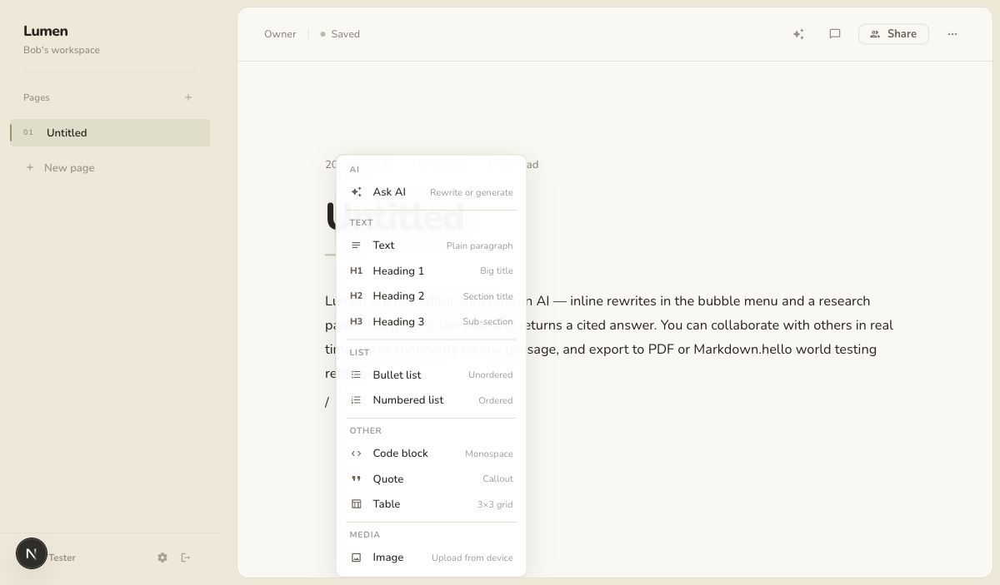
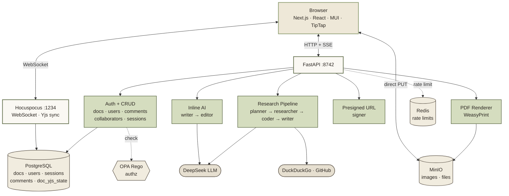
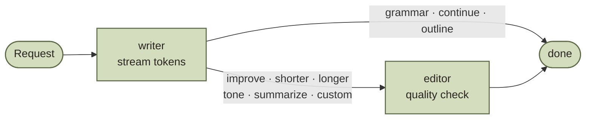
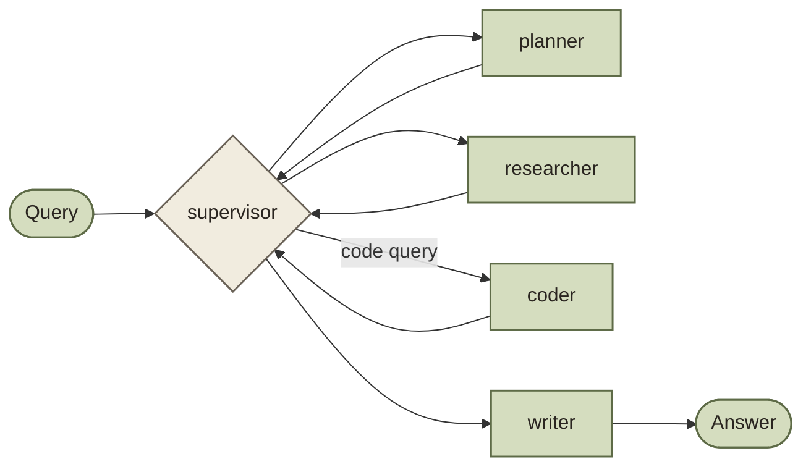

# Lumen

A self-hosted document editor with real-time collaboration, inline AI, and a research pipeline that cites its sources. Think Google Docs × Perplexity, runs on your hardware.


## Features

**Rich-text editor.** Headings, lists, quotes, code blocks with syntax highlighting (40+ languages via lowlight), tables with drag-to-resize, image upload, and a slash menu for fast block insertion.



**Real-time collaboration.** Multiple people can edit the same doc with Yjs CRDTs; edits merge without conflicts and survive offline. Live cursors show where everyone is, a presence avatar stack shows who's in the doc, and a share popover grants access as editor or viewer — or opens it up to the whole workspace.

**Inline AI.** Select text, hit AI in the bubble menu, pick Improve / Shorter / Longer / Grammar / Tone / Summarize, or type a custom instruction. On empty lines, type `/` and pick Ask AI to Continue writing or Write outline. Responses stream token-by-token, and you can Replace, Insert below, Try again, or Discard.

**Research panel.** Opened with the sparkle button or `⌘K`. A four-agent LangGraph pipeline (planner → researcher → coder → writer) hits DuckDuckGo and GitHub and returns a cited answer in Markdown.

**Threaded comments.** Highlight any passage and leave a comment. Replies thread under the first message, threads can be resolved or reopened, and the highlight travels with the text as edits happen (it's a TipTap mark synced through Yjs, not a brittle character-offset anchor).

**Export.** Download the current doc as Markdown (client-side via turndown) or PDF (server-side via WeasyPrint — tables, images and all, with internal MinIO URLs rewritten automatically).

**Image uploads.** Paste, drop, or pick from the slash menu. Files go straight from the browser to MinIO via a presigned PUT URL — the backend only signs, never handles bytes.

**Auth & access.** Email/password with bcrypt and a short-lived JWT in an httpOnly cookie. OPA Rego enforces per-doc access. Docs can be private (invite only) or workspace-wide. AI endpoints are rate-limited per user.

**Observability.** OpenTelemetry auto-instruments every request, DB query, and outgoing HTTP call. Logs are correlated to spans via `trace_id`/`span_id`. Spans stay in-process by default; set `OTEL_EXPORTER_OTLP_ENDPOINT` to ship them to Jaeger / Tempo / SigNoz / Honeycomb / etc.

**Everything works in dark mode.** Mobile layout collapses the sidebar into a drawer triggered by a hamburger; the share button becomes icon-only; popovers size to the viewport.

## Architecture



Inline AI and the research pipeline share the DeepSeek client and nothing else. Inline AI is a two-node graph optimised for sub-two-second latency and runs without web tools. The research pipeline is a four-agent supervisor graph that takes ten to thirty seconds and pulls in sources from the web. The Hocuspocus collab server keeps a Yjs state blob in Postgres (`doc_yjs_state`) so it survives restarts and late joiners get the right state.

### Inline AI



The writer streams tokens from DeepSeek using an action-specific prompt. For actions where quality matters (improve, shorter, longer, tone, summarize, custom), an editor node runs after with its own LLM call, returns a JSON verdict, and emits a revision event only if it actually changed anything. Grammar, continue, and outline skip the editor because a second pass adds no value.

### Research pipeline



The supervisor reads shared state and routes to the next node deterministically. It skips the coder for non-code queries, retries the researcher if results are thin, and never calls an LLM to decide what to do next.

### Comments

Highlighted passages are wrapped in a custom TipTap mark (`<span data-thread-id="...">`). Because marks are part of the ProseMirror schema, Yjs serializes them along with everything else — so the highlight moves with the text as others edit around it. The thread content (author, body, replies, resolved state) lives in Postgres keyed on `thread_id`. Deleting a thread strips the mark from the doc via a diff against the previous thread list, so highlights don't linger.

## Running it

You need Docker, a DeepSeek API key, and optionally a GitHub token (raises the code search rate limit from 60 to 5000 per hour).

```bash
cp .env.example .env
# set POSTGRES_PASSWORD, SECRET_KEY (32+ chars),
# MINIO_ROOT_USER, MINIO_ROOT_PASSWORD, MINIO_BUCKET
docker compose up --build
```

Open http://localhost:3847 and sign up. After signup, visit **Settings → API Keys** and paste your DeepSeek key — AI actions return a "Configure AI in Settings" prompt until a key is configured.

### Environment

```
SECRET_KEY             openssl rand -base64 32 (32+ chars required)
POSTGRES_PASSWORD      anything
DATABASE_URL           postgresql://postgres:<pw>@postgres:5432/app

DEEPSEEK_BASE_URL      https://api.deepseek.com
DEEPSEEK_MODEL         deepseek-chat
GITHUB_TOKEN           optional

MINIO_ROOT_USER        minioadmin
MINIO_ROOT_PASSWORD    changeme
MINIO_BUCKET           lumen-uploads

NEXT_PUBLIC_COLLAB_URL ws://localhost:1234

REDIS_URL              redis://redis:6379/0   (optional; in-memory fallback)

OTEL_EXPORTER_OTLP_ENDPOINT   http://collector:4318   (optional; ship spans)
OTEL_SERVICE_NAME             lumen-backend           (optional)
```

DeepSeek API keys live in the database, not env. Each user configures their own in Settings → API Keys (encrypted at rest). Workspace admins can also set a shared key that other members use as a fallback.

### Ports

| Service | Port | Purpose |
|---------|------|---------|
| `web` | 3847 | Next.js frontend |
| `research-api` | 8742 | FastAPI backend |
| `collab` | 1234 | Hocuspocus WebSocket (Yjs sync) |
| `postgres` | 5434 | Database |
| `minio` | 9000, 9001 | Object store (API + console) |
| `opa` | 8181 | Policy evaluation |
| `redis` | 6379 | Rate limit counters |

### Without Docker

Backend:

```bash
cd apps/backend
python -m venv .venv && source .venv/bin/activate
pip install -r requirements.txt
ENV_FILE=../../.env uvicorn app.main:app --reload --port 8742
```

Frontend:

```bash
cd apps/web
npm install
npm run dev
```

Or from the root with Turborepo: `npm install && npm run dev`.

You still need Postgres, MinIO, and the collab service running somewhere — easiest is `docker compose up postgres minio minio-init collab opa`.

### Lint

```bash
cd apps/backend && ruff check . && ruff format .
cd apps/web && npm run lint && npm run build
```

## API

Everything lives under `/api/v1/`. Auth is a session cookie set by the login endpoint.

```
POST   /api/v1/auth/signup
POST   /api/v1/auth/login
POST   /api/v1/auth/logout
GET    /api/v1/auth/me
GET    /api/v1/auth/ws-token           short-lived token for Hocuspocus

POST   /api/v1/ai/inline               SSE stream (writer + editor)
POST   /api/v1/research                JSON response
POST   /api/v1/research/stream         SSE stream per agent

GET    /api/v1/sessions
GET    /api/v1/sessions/:id
DELETE /api/v1/sessions/:id

GET    /api/v1/content/docs
POST   /api/v1/content/docs
GET    /api/v1/content/docs/:id
PATCH  /api/v1/content/docs/:id
DELETE /api/v1/content/docs/:id
PATCH  /api/v1/content/docs/:id/visibility     private | org
GET    /api/v1/content/docs/:id/export/pdf     application/pdf

POST   /api/v1/content/docs/:id/collaborators
PATCH  /api/v1/content/docs/:id/collaborators/:userId
DELETE /api/v1/content/docs/:id/collaborators/:userId

GET    /api/v1/content/docs/:id/comments
POST   /api/v1/content/docs/:id/comments        create thread with first message
POST   /api/v1/content/comments/:threadId/messages   reply
PATCH  /api/v1/content/comments/:threadId       { resolved: bool }
DELETE /api/v1/content/comments/:threadId       creator only

GET    /api/v1/content/collaborators/my
DELETE /api/v1/content/collaborators/:userId    bulk remove across all docs

POST   /api/v1/uploads/presign                  { content_type, kind } → PUT URL + public URL

GET    /api/v1/settings/profile
PATCH  /api/v1/settings/profile
POST   /api/v1/settings/password
GET    /api/v1/settings/credentials
PUT    /api/v1/settings/credentials/user
DELETE /api/v1/settings/credentials/user
PUT    /api/v1/settings/credentials/workspace    admin only
DELETE /api/v1/settings/credentials/workspace    admin only

GET    /api/v1/users/search?email=
```

The AI endpoints are rate-limited at 20 requests/minute and 300 requests/hour per user. Counters live in Redis with a fixed-window scheme (`rate:{user_id}:m:{minute}`), with an in-memory fallback if Redis is unreachable so a Redis outage doesn't block AI.

## Layout

```
apps/
  backend/
    app/
      agents/
        inline/          writer, editor, graph, prompts, state, llm_client
        planner.py
        researcher.py
        coder.py
        writer.py
        supervisor.py
      db/                asyncpg layer — docs, comments, sessions, users, uploads
      middleware/        auth, opa, ratelimit
      migrations/        SQL, numbered, run by postgres on first init
      models/
      routers/           ai, auth, comments, docs, sessions, uploads, users
      services/          pdf (WeasyPrint), crypto, llm_resolver
      tools/             web_search, doc_reader, github_search
      graph.py           research supervisor graph
      main.py
    tests/
  collab/
    src/index.ts         Hocuspocus server, loads/saves Yjs state to Postgres
    Dockerfile
  web/
    src/
      app/
        (auth)/          login, signup
        api/backend/     proxy to FastAPI
        docs/[id]/       editor page
        layout.tsx
      components/
        docs/
          ai/                    AIPanel, PresetList, PromptInput,
                                 ToneSubmenu, StreamingPreview, PreviewActions
          editor/                TipTap glue extracted from DocEditor
            editorSx.ts            editor CSS
            codeBlock.ts           lowlight setup + LumenCodeBlock
            collaborationCursor.ts CollaborationCursorExt + cursorColor
            blockMenu.tsx          slash-menu groups + withSlashDelete
            TextBubbleMenu.tsx     selection toolbar
            TableBubbleMenu.tsx    table toolbar
            SlashMenu.tsx          floating `/` menu
          comments/              CommentsPanel sub-components
            Avatar.tsx             initials + deterministic color
            Message.tsx            single message row
            ThreadCard.tsx         full thread with reply + actions
            timeAgo.ts             compact time formatter
          CodeBlock.tsx          syntax-highlighted code NodeView
          DocEditor.tsx          orchestrator — hooks up extensions + menus
          DocSidebar.tsx         responsive: inline on desktop, drawer on mobile
          DocResearchPanel.tsx
          DocMenu.tsx            three-dots menu with Export
          CommentsPanel.tsx      right-side drawer
          CommentComposer.tsx    anchored popover
          CollaboratorList.tsx
          PresenceAvatars.tsx
          ShareButton.tsx
        chat/
        layout/
        shared/          FormInput, FormSelect
      hooks/             useInlineAI, useChat, useDoc, useDocs, useComments,
                         useCollabProvider, useCurrentUser, useSessions
      lib/
        api.ts
        commentMark.ts           TipTap Mark for comment anchors
        editor-context.ts
        export.ts                Markdown + PDF download helpers
        markdown.ts
        types.ts
policies/                OPA Rego
docker-compose.yml       postgres · opa · redis · research-api · collab · minio · web
```

## Stack

DeepSeek for the LLM calls, LangGraph for agent orchestration, FastAPI with asyncpg and SSE streaming on the backend, Hocuspocus + Yjs for the collab server, Next.js 16 App Router with React 19 and Material UI 7 on the frontend, TipTap v3 for the editor, lowlight with highlight.js for syntax colors, marked and DOMPurify for the markdown-to-ProseMirror pipeline, WeasyPrint for PDF export, MinIO for object storage, Redis for rate limit counters, PostgreSQL, OPA for authorization, OpenTelemetry for traces and log correlation, Turborepo, Docker.

## License

MIT
